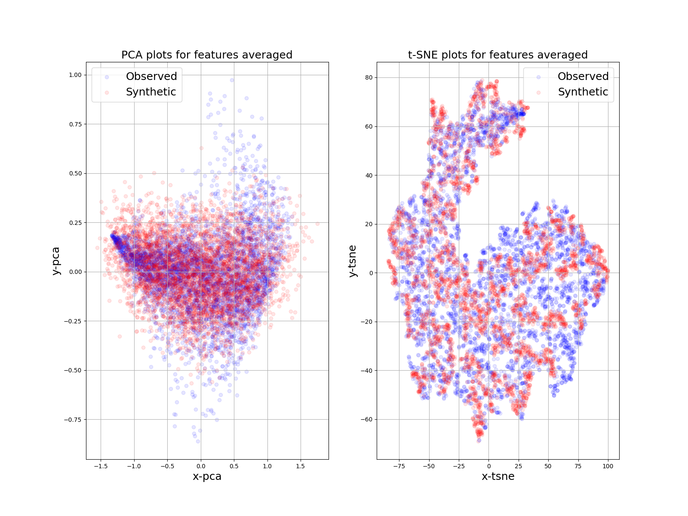
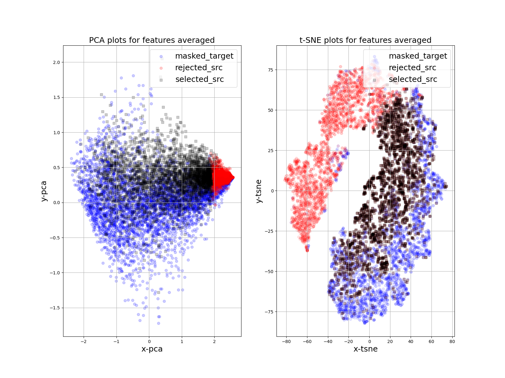

# DASTSF

## Introduction
This code is the implementation of the paper "A data-level augmentation framework for time series forecasting with ambiguously related source data". 


## Usage
use dataset **tourism-yearly** as example:

### step1. process data

```Bash
python3 Generation/generated_trend_season/process_data.py --seq_len 8 --file_target_train ./Generation/generated_trend_season/data/tourism_yearly_train_data --file_target_mask ./Generation/generated_trend_season/data/tourism_yearly_mask_data --data_name tourism_yearly
```    

### step2. data augmentation
```Bash
python3 Generation/main_generation.py --dataset Generation/generated_tourism_yearly/data/tourism_yearly.pkl \
--device 0 \
--task_name tourism_yearly \
--root_dir Generation/generated_trend_season/result \
--ae-epochs 1500 \
--gan-epochs 3000 \
--d-update 5 \
--eval-ae False \
--seq-len 8 \
--dim 1 \
--gan-lr 1e-4 \
--gan-alpha 0.99 \
--noise-dim 96 \
--embed-dim 96 \
--hidden-dim 24 \
--layers 3 \
--ae-lr 1e-3 \
--weight-decay 0 \
--scale 1 \
--dropout 0.0 \
--ae-batch-size 128 \
--gan-batch-size 128 \
--training-ae True \
--fpath_result Generation/generated_trend_season/result/tourism_yearly/re_scale_result_new \
--pics_dir Generation/generated_trend_season/result/tourism_yearly/pics
```

result picture: 



### step3 select similar src data
```batch
python3 Selection/anchor_cluster.py --source_dataset ./Selection/pre_tourism/data/source_data \
--dataset ./Generation/generated_trend_season/data/tourism_yearly.pkl \
--device 0 \
--root_dir ./Generation/generated_trend_season/result \
--ae-epochs 2000 \
--gan-epochs 6000 \
--d-update 5 \
--dim 1 \
--gan-lr 1e-4 \
--gan-alpha 0.99 \
--noise-dim 96 \
--embed-dim 96 \
--hidden-dim 24 \
--layers 3 \
--ae-lr 1e-3 \
--weight-decay 0 \
--scale 1 \
--dropout 0.0 \
--ae-batch-size 128 \
--gan-batch-size 128 \
--training-ae False \
--epochs 2000 \
--seq_len 8 \
--tri_layers 2 \
--tri_batch_size 128 \
--fea-batch-size 128 \
--dist_type cosine \
--triloss_mean True \
--margin 1 \
--weight_temp 0.5 \
--n_neighbors 10 \
--epoch_train 300 \
--model_save_path ./Selection/src_tgt_model/model_save \
--layers_tri 1 \
--fpath_normalize_train_fea Generation/generated_trend_season/data/tourism_yearly_normalize_train_fea \
--fpath_normalize_train_data Generation/generated_trend_season/data/tourism_yearly_normalize_train_data \
--fpath_normalize_mask_fea Generation/generated_trend_season/data/tourism_yearly_normalize_mask_fea \
--fpath_normalize_mask_data Generation/generated_trend_season/data/tourism_yearly_normalize_mask_data \
--fpath_normalize_src_data Generation/generated_trend_season/data/tourism_yearly_src_data \
--fpath_normalize_src_fea Generation/generated_trend_season/data/tourism_yearly_src_fea \
--fpath_train_data Generation/generated_trend_season/data/tourism_yearly_train_data \
--fpath_mask_data Generation/generated_trend_season/data/tourism_yearly_mask_data \
--save_mean_src_tgt_score True \
--save_src_tgt_score True \
--fpath_mean_src_tgt_score ./Selection/src_tgt_model/model_save/selected_src/mean_src_tgt_score \
--fpath_select_src_data ./Selection/src_tgt_model/model_save/selected_src/select_src_data \
--fpath_no_select_src_data ./Selection/src_tgt_model/model_save/selected_src/no_select_src_data \
--fpath_src_tgt_score ./Selection/src_tgt_model/model_save/selected_src/src_tgt_score \
--ratio 0.45 \
--read-dist True \
--temperature 0.1 \
--contrast_mode one \
--base_temperature 0.1 \
--rho 0.05 \
--cluster 5 \
--mining_ratio 0.2 \
--cluster-epochs 600 \
--run-cluster False \
--fpath_cluster_labels Selection/src_tgt_model/cluster/cluster_labels \
--fpath_cluster_centers Selection/src_tgt_model/cluster/cluster_centers \
--fpath_dist_src_tgt_index Selection/src_tgt_model/cluster/dist_src_tgt_index_sort \
--fpath_dist_src_tgt_sort Selection/src_tgt_model/cluster/dist_src_tgt_sort \
--fpath_dist_src_tgt Selection/src_tgt_model/cluster/dist_src_tgt
```

result picture: 



We run this code on python >= 3.7.12 with GPU, you can change it according to the configuration.  

### Thanks

our project is based on the following paper:
```
* K. R. Hengzhi Pei, Yuqing Yang, "Towards Generating Real-World Time Series Data," ICDM, pp. 469-478, 2021.
* X. Zhang, J. Cao, C. Shen, and M. You, "Self-training with progressive augmentation for unsupervised cross-domain person re-identification," in ICCV, 2019, pp. 8222-8231.
* D. C. B. N. Oreshkin, N. Chapados and Y. Bengio, "N-BEATS: Neural basis expansion analysis for interpretable time series forecasting," presented at the ICLR, Addis Ababa, Ethiopia, 2020.
* D. Salinas, V. Flunkert, J. Gasthaus, T. Januschowski, and R. J. Hyndman, "DeepAR: Probabilistic forecasting with autoregressive recurrent networks," International Journal of Forecasting, vol. 36, pp. 1181-1191, 2020.
* H. Zhou, S. Zhang, J. Peng, S. Zhang, J. Li, H. Xiong, et al., "Informer: Beyond efficient transformer for long sequence time-series forecasting," in AAAI, 2021, pp. 11106-11115.
```


Thanks for the contributions of these great works.